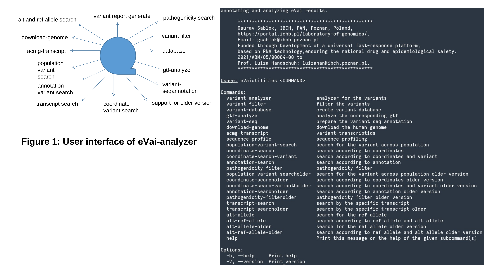

# Summary
      Analyzing genomic variants and identifying genomic variants is particularly helpful in case of linking the disease onset to the genomic predictions. Genomic variants play a key role in the identifcation and characterization of the disease onset and also allow for the genomic variability and hypothesis testing. eVai, which is a variant annotation platform provides the indepth analysis and annotation of the genomic variants and to annotate and analyze thos egenomics variants, it uses several backhand open source databases and tools. eVaiutilities proposed in this paper, is a data management software for the analysis of the eVai output files. It allows the analysis of the genomic variants further such as analyzing the multiple genomic anntoated variants, reference and alternate allele, enabling cocordinate search, annotation search across a large number of population. The availability of the command line parameters allows for a large scale analysis across the several population files. 

# Statement of need:
     Human genomics has always been an intriguing and gleaming topic of interest. Many efforts have been laid for understanding and identifying variants. Apart from the open source genomics efforts, proprietary efforts have been developed for the identification and annotation of the variants. The identified variants have been classified and linked to the several levels of the disease ontology and the metabolism levels. One such effort is the eVai https://www.engenome.com/product/, which is a high throughput variant annotator, and provides the hierarchical classification of the genomic variants. However, the limitation of the eVai output files is the information spanning across the multiple files and the missing of the genome information and sub-sequence analysis on the annotated variants. eVaiutilities allows, you to use the output from the eVai and performs genome scale analysis of the eVai annotated variants. It allows you to search across populations, variants and spanning information across multiple samples. It is encoded in RUST and provides scalability. 

# Figures
{width=60%}

# eVaiutilities: 
     Variant annotation and identifying the variants associated with the human genome has wide significance and is of utmost importance taking into account the wide growth of the disease association that are happening worldwide.  Much of the tools have been developed for the annotation of the variants that focuses on the annotation of the variants using the several pre-established database [@Wang2010-mh, @Obenchain2014-jj]. Apart from the significant development in the open source genomics[@McLaren2016-jo, @Pedersen2022Echtvar], parallel efforts have been laid down for the foundation in industrial research. One such effort is eVai https://www.engenome.com/product/ , which provides customary analysis of the variants by comparing the variants across the several tools and databases and provides TSV files with the annotations mapped. However, use profile generation and customary analysis is needed for the reports to make personal genomics easier. eVai-analyzer provides from variant report generation to the user specified database and sequence annotation. Embedded features such as the generation of the transcript that are linked to specific variant and also allows for the variant filter. There are several features preent i the eVaiutilities such as enabling the population wide analysis of a aprticular variant, coordinate search for all the variants between the population scale, coordinate seach with the variant search between the population scale, sequence specific analysis. eVaiutilities has been build using the memory safe RUST ecosystem. eVaiutilities is available from https://github.com/IBCHgenomic/eVai-utilities and is also available as a crate from https://crates.io/crates/eVaiutilities. eVai-utilities has multiple options to support for the downstream analysis

 # Acknowledgements
      Funded through Development of a universal fast-response platform, based on RNA technology,ensuring the national drug and epidemiological safety. 2021/ABM/05/00004-00. 

 # References
